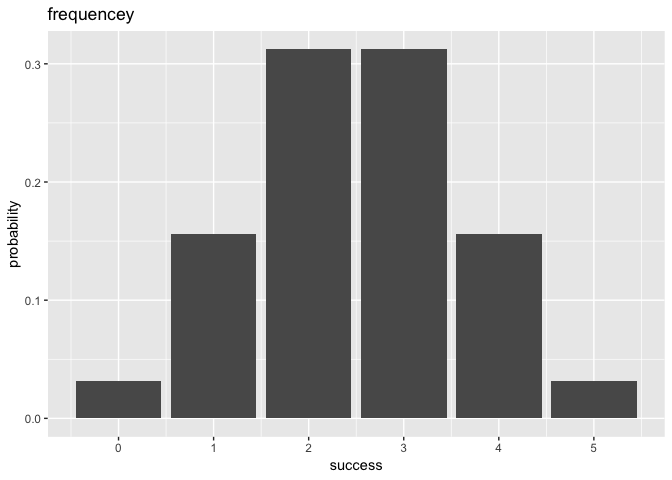
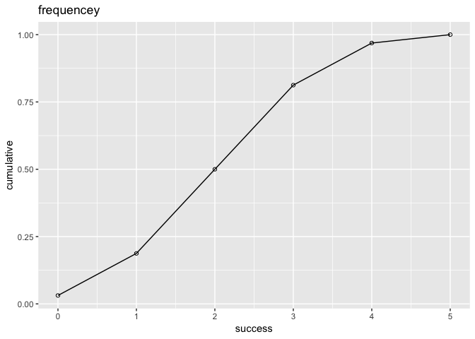

## Overview

`binomial` is a minimal package that provides functions to get the
probability given trials, success time and provides the functions to get
summary measures like mean, variance, etc. It also generates some plots
to show the probability and cumulative probability.

  - `plot()` method plot probablity of each success and cumulative
    probablities.
  - `summary()` method for get the summary of the parameters and
    measures

# Usage

``` r
library(binomial)
#> 
#> Attaching package: 'binomial'
#> The following object is masked from 'package:graphics':
#> 
#>     plot
# get the total combination number
bin_choose(5, 1:3)
#> [1]  5 10 10
#get the probability
bin_probability(5,trials = 10, prob = 0.5)
#> [1] 0.2460938

# get the distribution and plot the distribution
bin_distribution(trials = 5, prob = 0.5)
#>   success probability
#> 1       0     0.03125
#> 2       1     0.15625
#> 3       2     0.31250
#> 4       3     0.31250
#> 5       4     0.15625
#> 6       5     0.03125
plot(bin_distribution(trials = 5, prob = 0.5))

# get the cumulative probabilities
bin_cumulative(trials = 5, prob = 0.5)
#>   success probability cumulative
#> 1       0     0.03125    0.03125
#> 2       1     0.15625    0.18750
#> 3       2     0.31250    0.50000
#> 4       3     0.31250    0.81250
#> 5       4     0.15625    0.96875
#> 6       5     0.03125    1.00000
plot(bin_cumulative(trials = 5, prob = 0.5))
#> Warning: package 'ggplot2' was built under R version 3.4.4
```

<!-- --><!-- -->

``` r

# get the variable and print the summary thing
bin_variable(trials = 10, p = 0.3)
#> "Binomial variable" 
#> 
#> Paramaters 
#>  - number of trials: 10 
#>  - prob of success: 0.3
summary(bin_variable(trials = 10, p = 0.3))
#> "Summary Binomial" 
#>  
#> Paramaters 
#> - number of trials: 
#> - prob of success: 
#>  
#> Measures 
#> - mean: 3 
#> - variance: 2.1 
#> - mode: 3 
#> - skewness: 0.2760262 
#> - kurtosis: -0.1238095


# get functions of measures
bin_mean(10, 0.3)
#> [1] 3
bin_variance(10, 0.3)
#> [1] 2.1
bin_mode(10, 0.3)
#> [1] 3
bin_skewness(10, 0.3)
#> [1] 0.2760262
bin_kurtosis(10, 0.3)
#> [1] -0.1238095
```

``` r
summary(bin_variable(trials = 10, p = 0.3))
#> "Summary Binomial" 
#>  
#> Paramaters 
#> - number of trials: 
#> - prob of success: 
#>  
#> Measures 
#> - mean: 3 
#> - variance: 2.1 
#> - mode: 3 
#> - skewness: 0.2760262 
#> - kurtosis: -0.1238095
```
