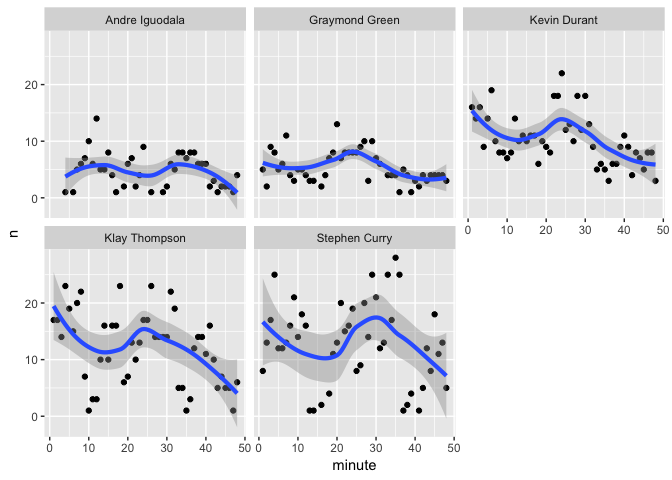

Workout01
================
kejun zhou
3/10/2019

Introduction
============


-   In the 2016-2017 season, Golden State Warriors season won their fifth Nba championship! It is extremely awesome especially after the dramatic collapse in 2015-2016 NBA finals. Warriors were hailed by the media and fans as "Superteam" since Durant, Curry, Klay Thompson, Draymond Green, the four all star players and one more experienced player Andre, assemble in one team, which make this team incredible. Are the Golden State Warriors the greatest team of all time? How did they perform in the 16-17 season after the collapse of 2015-2016? This report is aimed at analyzing their shooting results based on 2016-2017 season. Based on their shooting percentage and their hotspot distribution, we will have a perview of their

background
==========

We need to admit that Warriors has the ability to bring the impossibility into reality. We cannot wait to see how their perform when the “super team” formed. Kevin Duarant was the newest member of the Golden State Warriors. His join signifies a new era of Warriors and even all NBA. The combination of Durant, Curry, Klay Thompson, Draymond Green and Andre makes this team has the potential to steamroll the opponent. Someone has concluded that "Stephen Curry is the face the of the franchise. Draymond Green is the manic heartbeat of the team. Klay is a video-game combo of the team’s defining attributes.Kevin Durant is simply the best player on the NBA’s best team.". After catching much media attension, it is the time to let this remarkably talented group show the world.

data
====

The data includes Andre Iguodala, Klay Thompson, Kevin Durant, Draymond Green and Stephen Curry's shooting data of 2 pointers and 3 pointers and whether those shots were made or missed. And it also includes shooting position in coordinates, the shooting time in minute and second and quarter, their action type, and the opponent.

analysis
========

the shooting percentage of "big 5"
----------------------------------

In order to get how “big 5” perform on their shooting on two pointers, three pointers and the percentage of the shooting, we could use the data to give our intuitively vision and do some quantitative analysis. We can use this shooting percentage to decide a wiser strategy in game according to their strength and weakness.
- First, I want to display their shooting percentage.

-   For the two pointer shooting, all of these players have more than 49% shooting percentage, which is very high. When we look deeper about the chart. Andre Iguodala is the one who made the most shots. However, we need to notice that Andre Iguodala made less shoots than the others.Thus, we can’t conclude that Andre Iguodala shoot better than others. Instead, Kevin curry shoots more than other and has higher percentage than others except Andre Iguodala. Kevin curry’s percentage of two pointers is 0.6065, which is very high.

``` r
two_point
```

    ##             name total made perc_made
    ## 1 Andre Iguodala   210  134 0.6380952
    ## 2   Kevin Durant   643  390 0.6065319
    ## 3  Stephen Curry   563  304 0.5399645
    ## 4  Klay Thompson   640  329 0.5140625
    ## 5 Graymond Green   346  171 0.4942197

-   For the three pointer shooting, the first one and the second one who made the shoots most are Klay Thompson and Stephen Curry. We can see that the percentage of three pointer of Klay Thompson and Stephen Curry is approximately same. The percentage of Klay Thompson is 0.4241 and Stephen Curry is 0.4075. If we want to choose someone to make three pointer, Klay Thompson and Stephen Curry maybe the best choice. Just like Thompson himeself said,"I’m not a ball-dominant player. I’m most effective when I’m moving off the ball, moving freely and playing off my teammates."

``` r
three_point
```

    ##             name total made perc_made
    ## 1  Klay Thompson   580  246 0.4241379
    ## 2  Stephen Curry   687  280 0.4075691
    ## 3   Kevin Durant   272  105 0.3860294
    ## 4 Andre Iguodala   161   58 0.3602484
    ## 5 Graymond Green   232   74 0.3189655


-   For the overall pointer shooting, Kevin Durant has a striking shooting percentage 0.54, which is the top one among these five players. Just like Chris Haynes says, from ESPN.com's . "Clearly the best player on the court, the dominant player on the floor, and I think he showed, without Steph in particular, he almost had a different bounce to his step." Andre Iguodala is always stable on his performance and his percentage is 0.5175. Even though he shoots less than others, but he has incredible shooting rate.

``` r
effective_point
```

    ##             name total made perc_made
    ## 1   Kevin Durant   915  495 0.5409836
    ## 2 Andre Iguodala   371  192 0.5175202
    ## 3  Klay Thompson  1220  575 0.4713115
    ## 4  Stephen Curry  1250  584 0.4672000
    ## 5 Graymond Green   578  245 0.4238754

the shooting hotspot
--------------------

-   In order to get analyze how each player perform in one season, investigating the shooting hot spot provides us an excellent opportunity to display each player’s basketball skill advantage and their overall ability and their speciality. In general, we only do the research on 3 point and 2 point lines.
    

-   From the hotspot of “big 5”, I find that Stephen Curry makes more shooting outside of the 3 point line than the others, which means that he could always serve as a threat outside the three point line in front of their opponent. Considering he is most extraordinary three point shooter in the history of NBA, it’s no wondering why he perform so well.
    

-   Compared with Stephen Curry, Klay Thompson and Kevin Durant makes more shooting inside the 2 point line, learning it from the density of the blue point of each player’s hotspot . From the analysis above, Durant has a very high shooting 2 point percentage than Klay Thompson. But we can learn Klay Thompson made more 3 point shooting than Kevin Durant. Thus, we can conclude that Klay Thompson is a powerful “3-D” player. 

-   From the analysis above, we find that “big 5” has tremendous power to control the court and they are well-rounded in the court especially Klay Thompson, Kevin Durant and Stephen Curry. This hotspot intuitively show their preference and speciality in the court.

The shooting time
-----------------

-   Next, I focus on the shooting time to show which quarter is the most scoring one. Andre Iguodala and Draymond Green are very stable during 4 quarters. They may have some fluctuation but they are not the main shooters in the game. From the past games, Draymond Green is regarded as most stable and most combustible warrior player. And Andre Iguodala is arguably the best bench tandem in the league. "There is only one basketball" is a trite however it is true. Everyone in the court needs to coordinate with others and satisfy the team goals even sacrifice their personal agendas. This is why Andre Iguodala and Draymond Green are not main shooters. We can see Klay Thompson, Kevin Durant, Stephen Curry are the main shooters in one game. But their peak shooting time is not all same. Stephen Curry got his most scoring at approximately 30 minutes from the game and Klay Thompson and Kevin Durant got their most scoring at the end of the second quarters. With the time goes by, they shoot less in the last quarters. Due to their dominant performance and their excellent coordination, they offensively got much scores in the preceding three quarters, so they have the greater chance to win the game in the last. This is the reason why they are called the “BIG 5”, the best league in the NBA history. Their combination makes Warriors much more powerful even exceeds the former league.

``` r
ggplot(data = c,aes(x = minute, y = n)) +
  geom_point(aes(x = minute, y = n))+geom_smooth(method=loess,size=1.5)+facet_wrap(~name)
```



conclusion
==========

-   Obviously, the warriors should be the best team in the history. Their talents and versatility make them and this team unassailable.Even though, It is too early to conclude their future. But the current crew has already produced a new batch of "Wow!" figures, so we can’t wait to see their next seasons performance. Win or loss is still a question.

### reference

<https://bleacherreport.com/articles/2749739-5-wild-stats-defining-golden-state-warriors-season#slide0> <https://bleacherreport.com/articles/2668019-golden-state-warriors-complete-2016-17-season-preview> <https://www.goldenstateofmind.com/2017/9/9/16211440/nba-2017-golden-state-warriors-season-review-kevin-durant>
